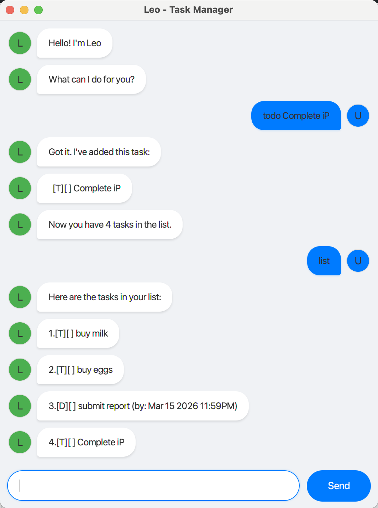

# Leo - Task Manager Chatbot



## Introduction

Leo is a command-line task manager chatbot that helps you organize daily tasks with support for Todos, Deadlines, and Events.

---

## Quick Start

1. **Download** the `leo.jar` file
2. Ensure you have installed **Java 17** JDK.
3. **Run** the application:
   ```bash
   java -jar leo.jar
   ```
4. **Start typing** commands!

---

## Features

### Tasks

Leo supports three types of tasks:

| Task Type | Description | Example |
|-----------|-------------|---------|
| **Todo** | A simple task with no deadline | `todo buy groceries` |
| **Deadline** | A task with a deadline | `deadline submit report /by 2025-12-31 2359` |
| **Event** | A task with a start and end time | `event meeting /from 2025-06-15 1400 /to 2025-06-15 1600` |

### Managing Tasks

#### Add a Todo: `todo`

Adds a todo task to Leo.

Format: `todo <description>`

Example: `todo buy groceries`

#### Add a Deadline: `deadline`

Adds a deadline task to Leo.

Format: `deadline <description> /by <datetime>`

Example: `deadline submit report /by 2025-12-31 2359`

#### Add an Event: `event`

Adds an event task to Leo.

Format: `event <description> /from <datetime> /to <datetime>`

Example: `event meeting /from 2025-06-15 1400 /to 2025-06-15 1600`

#### List all tasks: `list`

Shows a list of all tasks stored in Leo.

Format: `list`

#### Mark a task as done: `mark`

Marks a task as done.

Format: `mark <task_number>`

Example: `mark 1`

#### Mark a task as not done: `unmark`

Marks a task as not done.

Format: `unmark <task_number>`

Example: `unmark 1`

#### Delete a task: `delete`

Deletes a task from Leo.

Format: `delete <task_number>`

Example: `delete 1`

#### Find tasks: `find`

Finds tasks whose descriptions contain the given keyword.

Format: `find <keyword>`

Example: `find meeting`

#### Undo last action: `undo`

Undoes the last action that modified the task list.

Format: `undo`

#### Exit the program: `bye`

Exits Leo.

Format: `bye`

---

## Date/Time Formats

Leo supports the following date/time formats:

| Format | Example |
|--------|---------|
| Date only | `2025-12-31` |
| Date + Time | `2025-12-31 2359` |
| Slash format | `31/12/2025 2359` |

---

## Data Storage

Leo automatically saves all tasks to `data/leo.txt`. You do not need to manually save anything.

---

## System Requirements

- **Java 17**

---

*Leo - Your personal task management assistant*
